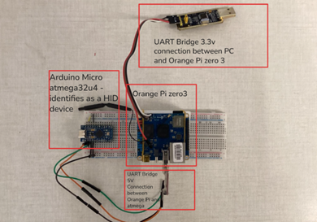

# BadUSB Keyboard Detector

Side-channel detector for BadUSB-style keyboard attacks, using keystroke biometrics (dwell time, flight time, QWERTY-distance statistics). Three independent AI engines are integrated into a live GUI application:

| Engine | Architecture | Features |
|--------|-------------|---------|
| MLP | Feedforward (17-feature window) | Dwell/flight stats + polynomial Fitts'-Law error |
| GRU | 2-layer recurrent (sequence) | Raw dwell + flight time series |
| HTM | Hierarchical Temporal Memory (anomaly) | 21-dim stats SDR + last-key identity SDR |

## Dataset

This project uses the **University at Buffalo (UB) Keystroke Biometric Dataset**.  
Access must be requested from the dataset maintainers:  
**https://www.buffalo.edu/cubs/research/datasets/ub-dataset.html**

Download and place the dataset at `../UB_keystroke_dataset/` relative to this repo root, so the directory structure is:

```
parent_dir/
    BadUSBDetection/        ← this repo
    UB_keystroke_dataset/
        s0/rotation/
        s1/rotation/
        s2/rotation/
```

---

## Installation

### Option A — Python venv (recommended)

**Windows** (cmd or PowerShell):
```cmd
py -3 -m venv .venv
.venv\Scripts\activate
pip install -r requirements.txt
```

**Linux / macOS / WSL:**
```bash
# Ubuntu/Debian — install venv support if missing (requires sudo)
sudo apt update && sudo apt install -y python3-venv python3-pip

python3 -m venv .venv
source .venv/bin/activate

# Ubuntu 24.04 / Debian 12+ only: bootstrap pip if the venv has none
python3 -m ensurepip --upgrade

pip install -r requirements.txt
```

> **Slow connection / pip timeout:** if `pip install` times out on large packages (e.g. torch), increase the timeout:
> ```bash
> pip install --timeout 120 -r requirements.txt
> ```

**GPU PyTorch (optional — skip if CPU-only):**
```bash
pip install torch --index-url https://download.pytorch.org/whl/cu121
```

### Option B — Conda

```bash
# 1. Create and activate a conda environment
conda create -n badusb python=3.10
conda activate badusb

# 2. Install all dependencies
pip install -r requirements.txt

# 3. GPU PyTorch (optional)
pip install torch --index-url https://download.pytorch.org/whl/cu121
```

> `requirements.txt` lists every dependency except `htm.core`, which needs a separate build step (see below). MLP and GRU work with just `requirements.txt`.

### HTM Core (from source — pip does NOT work)

The HTM engine requires `htm.core`, which must be compiled from the Numenta community source.  
Do **not** use `pip install htm.core` — the PyPI package is outdated and missing the C++ bindings.

```bash
# Build dependencies
# venv: pip install cmake  OR  system: sudo apt install cmake libboost-all-dev
# conda: conda install -c conda-forge cmake boost

git clone https://github.com/htm-community/htm.core.git
cd htm.core
pip install .   # compiles C++ bindings (~5–15 min)
cd ..
```

If the build fails, see the [htm.core build docs](https://github.com/htm-community/htm.core#building-from-source).  
The MLP and GRU engines work without HTM — the GUI disables the HTM button gracefully if the import fails.

### Verify

```bash
python3 -c "import torch; print('PyTorch:', torch.__version__)"
python3 -c "from htm.bindings.sdr import SDR; print('HTM OK')"
```

---

## Running the Live Detector (existing models)

Pre-trained models are included in the repository via **Git LFS** (`.pth`, `.npy`, `.npz`, `.pkl` files).  
Git LFS must be installed before cloning, otherwise the model files will be downloaded as small pointer text files instead of the actual binaries.

**Install Git LFS** (once per machine):
- Windows: download from https://git-lfs.com and run the installer
- Linux/WSL: `sudo apt install git-lfs`
- macOS: `brew install git-lfs`

**Clone and pull LFS files:**

```bash
git lfs install                                              # enable LFS for your git
git clone https://github.com/YuvalMandel/BadUSBDetection.git
cd BadUSBDetection
git lfs pull                                                 # download binary model files
```

> If you cloned without LFS installed first, run `git lfs install` then `git lfs pull` inside the repo to download the model files retroactively.

**Launch the GUI:**

```bash
# Windows
python BadUSBDetector/detector.py

# Linux / macOS / WSL
python3 BadUSBDetector/detector.py
```

The GUI shows a traffic-light indicator:
- **Green** — human typing detected
- **Yellow** — elevated anomaly score (suspicious)
- **Red** — BadUSB detected; click "RESET ALARM" to resume monitoring

Switch between MLP, GRU, and HTM engines at runtime using the radio buttons.

---

## Training on a SLURM Cluster

All SLURM scripts are in `slurm/`. They assume the `htm_keyboard_1` conda environment and Newton-style paths. Adapt `ENV_NAME` and partition/account lines for your cluster.

### Full pipeline (data → train all three models)

```bash
cd <repo-root>
bash slurm/full_pipeline.sh [--mode full] [--search] [--n-configs 128]
```

Options:
- `--mode full` — use all keystroke data (recommended; default is `partial`)
- `--search` — run Optuna HP search for MLP and GRU (~50 trials each)
- `--n-configs N` — number of random HTM configs to search (default 128)

The pipeline submits jobs with SLURM dependency chaining automatically.

### Fullkey training (best-known HPs, recommended)

If you already have HP search results:

```bash
# MLP
sbatch slurm/fullkey_mlp.sh

# GRU
sbatch slurm/fullkey_gru.sh

# HTM (trains best config on all data)
sbatch slurm/fullkey_htm.sh
```

### Collect HTM results after HP search

```bash
sbatch slurm/collect_htm_fullkey.sh
```

This evaluates all completed HTM configs, ranks them, and writes `results/HTM/leaderboard_fullkey.txt`.

---

## Single-Model Training (local or interactive)

### MLP

```bash
# 1. Generate data
cd dataset_generator
python bot_generator.py  -o Synthetic_Bots      -f 100 -e 200
python bot_generator.py  -o Synthetic_Bots_test -f  20 -e 200
python human_generator.py -o Balanced_Humans      -f 124 -l 80 -e 1
python human_generator.py -o Balanced_Humans_test -f  24 -l 80 -e 0
cd ..
python split_persons.py --bots-dir dataset_generator/Synthetic_Bots \
    --ub-dir ../UB_keystroke_dataset --sessions s0 s1 s2 --tasks 1

# 2. Train regressor
cd MLP/regressor
python regressor_train.py -hu ../../dataset_generator/Balanced_Humans -m poly_regressor.pkl
cp poly_regressor.pkl ../
cd ..

# 3. Feature extraction
python dataset_csv_generator.py --split-json ../data_split.json --mode full --tag fullkey

# 4. HP search (optional, ~50 trials)
python model_training.py --split-json ../data_split.json --mode full --tag fullkey --search --n-configs 50

# 5. Final training with best HPs
python model_training.py --split-json ../data_split.json --mode full --tag fullkey \
    --hps-json ../results/MLP/mlp_best_hps_fullkey.json
```

### GRU

```bash
# From repo root — requires data_split.json (see MLP step 1 above)
cd GRU
python translate_to_tensors.py --split-json ../data_split.json --mode full --tag fullkey

# HP search (optional)
python train_gru.py --split-json ../data_split.json --mode full --tag fullkey \
    --search --n-configs 50

# Final training with best HPs
python train_gru.py --split-json ../data_split.json --mode full --tag fullkey \
    --hps-json ../results/GRU/gru_best_hps_fullkey.json
```

### HTM

HTM training uses a two-step random HP search:

```bash
# 1. Prepare data (windows cache — run once)
python HTM/htm_prepare_data.py --tag fullkey

# 2. Generate random configs
python HTM/htm_generate_configs.py --n-configs 128 --tag fullkey --cache HTM/windows_cache_fullkey.pkl

# 3. Submit the generated SLURM array (runs one job per config)
sbatch slurm/train_htm_fullkey_array.sh

# 4. After all jobs finish, collect results and evaluate best model on test set
python HTM/htm_collect_results.py --tag fullkey --top 20

# 5. (Optional) Retrain the single best config with unlimited data
python HTM/htm_train.py \
    --config HTM/configs/config_NNNN.json \
    --cache  HTM/windows_cache_fullkey.pkl \
    --tag    fullkey
```

The `htm_collect_results.py` script evaluates the best val-F1 config on the test split and writes `results/HTM/final_test_results_fullkey.json` and a confusion matrix plot.

---

## Results (pre-trained fullkey models)

| Model | Val F1 | Test F1 |
|-------|--------|---------|
| MLP   | 0.8817 | 0.8657  |
| GRU   | 0.9474 | 0.9524  |
| HTM (cfg_0449) | 0.7333 | 0.7143 |

---

## BadUSB Emulator

The `BadUSBemulator/` directory contains a hardware-software platform for emulating malicious USB HID attacks. It is used to test the detector against realistic attack profiles without a real BadUSB device.

### Hardware



| Component | Role |
|-----------|------|
| **Orange Pi Zero 3** (host controller) | Runs `BadUSBemulator.py` — parses the payload script, generates keystroke timing arrays, and sends press/release commands over UART. Accessed via SSH. |
| **Arduino Pro Micro** (ATmega32U4) | Connected to the target PC via USB. Receives UART commands from the Orange Pi and injects them as real HID keyboard events using the Arduino `Keyboard.h` library. |

The Orange Pi operates at 3.3V logic; the Arduino at 5V. The UART link between them (TX/RX/GND) bridges these two voltage levels. The Arduino's USB port appears to the target PC as a standard keyboard.

### Setup

**1. Flash the Arduino firmware**

Open `BadUSBemulator/AtmegaKeyboard.cpp` in the Arduino IDE (or `arduino-cli`), select board **Arduino Pro Micro (ATmega32U4)**, and upload. The sketch listens on `Serial1` at 115200 baud for `P,<keycode>` (press) and `R,<keycode>` (release) commands.

**2. Wire Orange Pi → Arduino**

```
Orange Pi TX  →  Arduino RX  (Serial1)
Orange Pi RX  →  Arduino TX  (Serial1)
GND           →  GND
```

Connect the Arduino USB to the **target PC** (the machine being monitored).

**3. Install Python dependencies on Orange Pi**

```bash
pip install pyserial numpy
```

**4. Adjust the serial port**

Edit `BadUSBemulator/BadUSBemulator.py` and set `UART_PORT` to match the device on your Orange Pi (default: `/dev/ttyUSB0`):

```python
UART_PORT = "/dev/ttyUSB0"
```

### Running an attack

```bash
python3 BadUSBemulator/BadUSBemulator.py BadUSBemulator/attack_example.txt
```

You will be prompted to choose an attack profile:

| # | Profile | Description |
|---|---------|-------------|
| 1 | Machine Gun | Near-zero delays, minimal variance — pure speed |
| 2 | The Robot | Perfectly uniform timing between every keystroke |
| 3 | Gaussian Faker | Normal-distributed delays that mimic human typing |
| 4 | Uniform Jitter | Random delays uniformly distributed within set bounds |
| 5 | Burst Mode | Fast bursts of keystrokes separated by longer pauses |

After selecting a profile you can either use random parameters (press `n`) or enter custom values (press `y`).

### Payload scripting syntax

Attack scripts (like `attack_example.txt`) use a simple format:

| Syntax | Meaning | Example |
|--------|---------|---------|
| Plain text | Typed character-by-character with attack timing | `whoami` |
| `delay(X)` | Hard pause for X milliseconds (OS wait, e.g. app launch) | `delay(1500)` |
| `[KEY]` | Special or modifier key | `[ENTER]`, `[TAB]`, `[ESC]`, `[F5]` |
| `[KEY1+KEY2]` | Key combination (all pressed together) | `[CTRL+ALT+t]`, `[CTRL+c]` |

Supported special keys: `[ENTER]`, `[SPACE]`, `[TAB]`, `[ESC]`, `[DELETE]`, `[PTRSCR]`, `[CTRL]`, `[ALT]`, `[SHIFT]`, `[WINDOW]`, `[F1]`–`[F12]`.

**Example payload** (`attack_example.txt`):
```
[CTRL+ALT+t]
delay(1500)
echo "hello from BadUSB"
[ENTER]
```
